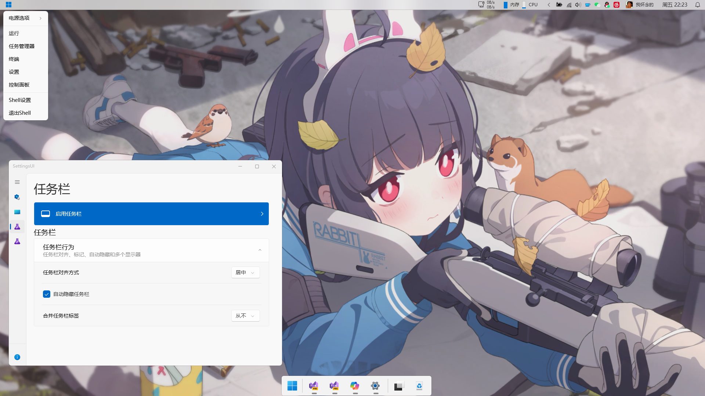

# Shell11 
> Shell11 项目起源于 [Cairo Desktop Environment](https://github.com/cairoshell/cairoshell) 大部分基础功能也来自于 Cairo Desktop 及 ManagedShell。

A highly extensible status / task bar written in C#.

  
  
  

# 预览

# ✨ TODO
太多以至于无法列出

# 🎁 Installation
todo

# 🔧 Develop Guide
todo